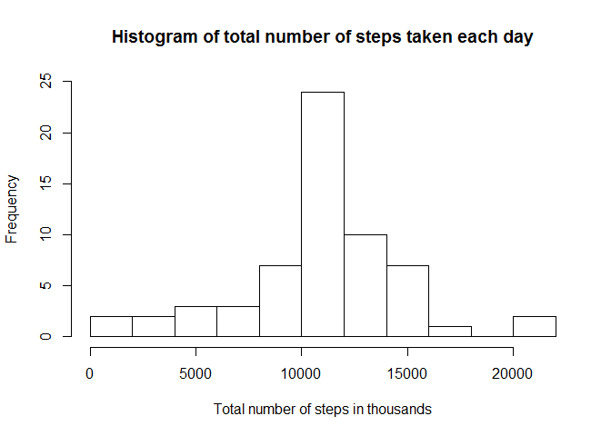

# Reproducible Research: Peer Assessment 1


## Loading and preprocessing the data

```r
library(magrittr)
library(dplyr)
```

```
## Warning: package 'dplyr' was built under R version 3.3.3
```

```
## 
## Attaching package: 'dplyr'
```

```
## The following objects are masked from 'package:stats':
## 
##     filter, lag
```

```
## The following objects are masked from 'package:base':
## 
##     intersect, setdiff, setequal, union
```

```r
library(ggplot2)

fileName <- "activity.zip"

## checks if datasets are available in the current working directory
if (!file.exists(fileName)){
  fileURL <- "https://d396qusza40orc.cloudfront.net/repdata%2Fdata%2Factivity.zip"
  download.file(fileURL, fileName, method="auto")
}  
#checks if datasets were unzipped - generally if we can access it 
if (!file.exists("activity.csv")) { 
  unzip(fileName) 
}

#loading data
activity <- read.csv("activity.csv", colClasses = "character",header = TRUE)

#transforming data column from character to Date
activity$date<-as.Date(activity$date,"%Y-%m-%d")

#transforming steps column from character to numeric
activity$steps<-as.numeric(activity$step)
```


## What is mean total number of steps taken per day?

```r
#calculating total number of steps taken per each day
stepsPerDay <- aggregate(activity$steps,by=list(activity$date),sum,na.rm=TRUE)
names(stepsPerDay)<-c("date","steps")

#Mean number of steps taken each day
stepMean<-mean(stepsPerDay$steps,na.rm = TRUE)
stepMean
```

```
## [1] 9354.23
```

```r
#Median number of steps taken each day
stepMedian<-median(stepsPerDay$steps,na.rm = TRUE)
stepMedian
```

```
## [1] 10395
```

```r
#ploting histogram of the total number of steps taken each day
hist(x = stepsPerDay$steps, breaks = 11, xlab = "Total number of steps in thousands", main = "Histogram of total number of steps taken each day",ylim=c(0,20),xlim=c(0,22000))
```

<!-- -->

## What is the average daily activity pattern?

```r
#calculating total number of steps taken per each interval
stepsPerInterval <- aggregate(activity$steps,by=list(as.numeric(activity$interval)),mean,na.rm=TRUE)
names(stepsPerInterval)<-c("interval","steps")

#plotting Average number of steps in time intervals as average daily activity pattern
ggplot(data=stepsPerInterval,aes(x=as.numeric(interval),y=steps))+
  xlab("Time interval")+ylab("Average number of steps")+geom_line()+
  ggtitle("Average daily activity pattern")
```

<!-- -->

```r
#Which 5-minute interval, on average across all the days in the dataset, contains the maximum number of steps
maxStepInterval<-stepsPerInterval[stepsPerInterval$steps==max(stepsPerInterval$steps),]
maxStepInterval
```

```
##     interval    steps
## 104      835 206.1698
```


## Imputing missing values

```r
#computing number of missing values in the dataset 
table(complete.cases(activity))[2]
```

```
##  TRUE 
## 15264
```

```r
#filling missing values with means from the 5minute interval from stepsPerInterval
activityNoNa<-activity[,c(1,3)]

activityNoNa <- transform(activity, steps = ifelse(is.na(activity$steps), stepsPerInterval$steps[match(activity$interval, stepsPerInterval$interval)], activity$steps))

#total number of steps taken each day with NA's imputed
stepsPerDayNoNa <- aggregate(activityNoNa$steps,by=list(activityNoNa$date),sum,na.rm=TRUE)
names(stepsPerDayNoNa)<-c("date","steps")

#histogram of the total number of steps taken each day
hist(x = stepsPerDayNoNa$steps, breaks = 11, xlab = "Total number of steps in thousands", main = "Histogram of total number of steps taken each day",ylim=c(0,20),xlim=c(0,22000))
```

<!-- -->

```r
#Mean number of steps taken each day
stepMeanNoNa<-mean(stepsPerDayNoNa$steps,na.rm = TRUE)
stepMeanNoNa
```

```
## [1] 10766.19
```

```r
#Median number of steps taken each day
stepMedianNoNa<-median(stepsPerDayNoNa$steps,na.rm = TRUE)
stepMedianNoNa
```

```
## [1] 10766.19
```
## Are there differences in activity patterns between weekdays and weekends?

```r
#adding new column with info on the weekday
library(lubridate)
```

```
## Warning: package 'lubridate' was built under R version 3.3.3
```

```
## 
## Attaching package: 'lubridate'
```

```
## The following object is masked from 'package:base':
## 
##     date
```

```r
activityNoNa<-mutate(activityNoNa,weekday=wday(activityNoNa$date))
```

```
## Warning: package 'bindrcpp' was built under R version 3.3.3
```

```r
#changing weekday to a factor 
activityNoNa$weekday<-as.factor(activityNoNa$weekday)

#changing weekday levels to 'weekday' & 'weekend'
levels(activityNoNa$weekday)<-c("weekday","weekday","weekday","weekday","weekday","weekend","weekend")

#recalculating steps per interval according to data with NA's imputed
stepsPerIntervalNoNa <- aggregate(activityNoNa$steps,by=list(as.numeric(activityNoNa$interval),activityNoNa$weekday),mean,na.rm=TRUE)
names(stepsPerIntervalNoNa)<-c("interval","weekday","steps")

#plotting average number of steps taken per each interval by weekday factor
ggplot(data=stepsPerIntervalNoNa, aes(x=as.numeric(interval),y=steps))+
  xlab("Time interval")+ylab("Average number of steps")+        geom_line()+facet_grid(stepsPerIntervalNoNa$weekday~.)+
  ggtitle("Average number of steps in time intervals")
```

<!-- -->
